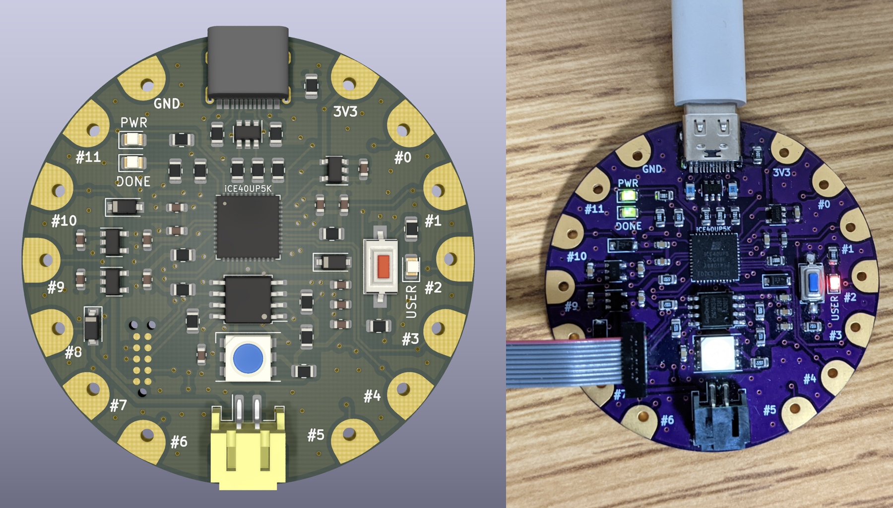
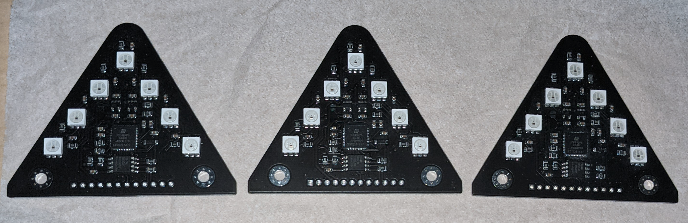
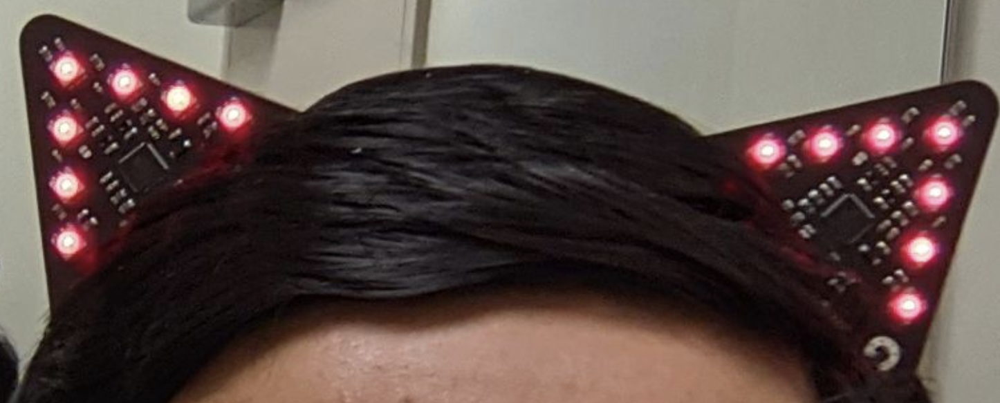

# iCE40 Wearables

This repo contains board designs (KiCad) for two iCE40 FPGA-based boards: one in a sewable form-factor and one in a cat-ear form factor.

### Board 1: Sewable

This board is inspired by the [Adafruit Flora](https://www.adafruit.com/product/659) and is meant to be sewn into clothing or accessories. It is shaped as a small circle and has all the components on the front side to allow it to sit flush against a flat surface. It includes the following features:

- iCE40UP5K FPGA
- 16Mb QSPI Flash (GD25Q16CSIGR)
- 16MHz Oscillator (SIT2001BI, multiple frequency options available)
- PWR/DONE/USER LEDs, USER pushbutton
- RGB LED (WS2812)
- 14 Electric Sewing Pads: 12x GPIO, 1x 3V3, 1x GND
- USB-C port
- JST power header
- Tag-Connect programming header

Schematic is in [ice40_sewable_board/schematic.pdf](ice40_sewable_board/schematic.pdf)

An example design (that utilizes the button, USER LED, RGB LED, and one of the sewing pads) is in [ice40_sewable_ref_design/](ice40_sewable_ref_design/)

### Board 2: Cat-ears

This board is meant to be shaped like a cat-ear, such that two of them can be worn on a headband (the GPIO pins can be wired together to provide synchronization between the ears). It was designed as a tribute to [YosysHQ](https://www.yosyshq.com/) who develop open-source FPGA software tooling. Each ear includes the following features:

- iCE40UP5K FPGA (internal 48MHz oscillator is used to simplify BOM)
- 16Mb QSPI Flash (GD25Q16CSIGR)
- 7x RGB LED (WS2812)
- Power options: JST power header OR CR2032 coin cell holder
- 2.54mm programming & GPIO header (can be programmed with small wire clips or by soldering)
- Additional GPIO pads on rear side for soldering

Schematic is in [ice40_catears_board/schematic.pdf](ice40_catears_board/schematic.pdf)

An example design (that builds separate modules for the left and right ears, and utilizes the RGB LEDs and GPIO pads) is in [ice40_catears_ref_design/](ice40_catears_ref_design/)

### Acknowledgements

Board design was inspired by [electronutlabs-public/ice-bling](https://gitlab.com/electronutlabs-public/ice-bling) and [icebreaker-fpga/icebreaker](https://github.com/icebreaker-fpga/icebreaker). CMU TechSpark and RoboClub were used for fabrication and materials.
